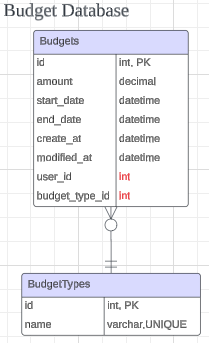

# Expense Tracker - Budget Microservice

# Endpoints - For details please check Swagger UI
## Endpoint: GET /api/budgets?user_id={user_id}&limit={limit}&offset={offset}
### Response Codes:
- 200: Success
- 500: Internal Server Error

### Request and Response Example: GET /api/budgets?user_id=1&limit=2&offset=5
#### response
```json
{
  "data": [
    {
      "data": {
        "amount": 1500.5,
        "budget_type_id": "Food",
        "created_at": "2024-10-01T17:58:20",
        "end_date": "2024-01-31",
        "id": 1,
        "modified_at": "2024-10-01T17:58:20",
        "start_date": "2024-01-01",
        "user_id": 1
      },
      "links": [
        {
          "href": "/api/budgets/1",
          "method": "GET",
          "rel": "self"
        },
        {
          "href": "/api/budgets/1",
          "method": "PUT",
          "rel": "update"
        },
        {
          "href": "/api/budgets/1",
          "method": "DELETE",
          "rel": "delete"
        }
      ]
    },
    {
      "data": {
        "amount": 2500.75,
        "budget_type_id": "Transportation",
        "created_at": "2024-10-01T17:58:20",
        "end_date": "2024-01-31",
        "id": 2,
        "modified_at": "2024-10-01T17:58:20",
        "start_date": "2024-01-01",
        "user_id": 2
      },
      "links": [
        {
          "href": "/api/budgets/2",
          "method": "GET",
          "rel": "self"
        },
        {
          "href": "/api/budgets/2",
          "method": "PUT",
          "rel": "update"
        },
        {
          "href": "/api/budgets/2",
          "method": "DELETE",
          "rel": "delete"
        }
      ]
    }
  ],
  "links": [
    {
      "href": "/api/budgets?user_id=1&limit=2&offset=5",
      "method": "GET",
      "rel": "self"
    },
    {
      "href": "/api/budgets?user_id=1&limit=2&offset=7",
      "method": "GET",
      "rel": "next"
    },
    {
      "href": "/api/budgets?user_id=1&limit=2&offset=3",
      "method": "GET",
      "rel": "prev"
    }
  ]
}
```

## Endpoint: GET /api/budgets/{budget_id}
### Response Codes:
- 200: Success
- 404: Expense Not Found
- 500: Internal Server Error

### Request and Response Example: GET /api/budgets/1
#### response
```json
{
  "data": {
    "id": 1,
    "amount": 1500.5,
    "start_date": "2024-01-01",
    "end_date": "2024-01-31",
    "created_at": "2024-12-11T15:16:23",
    "modified_at": "2024-12-11T15:16:23",
    "user_id": 1,
    "budget_type_id": "Food"
  },
  "links": [
    {
      "rel": "self",
      "href": "/api/budgets/1",
      "method": "GET"
    },
    {
      "rel": "update",
      "href": "/api/budgets/1",
      "method": "PUT"
    },
    {
      "rel": "delete",
      "href": "/api/budgets/1",
      "method": "DELETE"
    }
  ]
}
```

## Endpoint: PUT /api/budgets/{budget_id}
### Response Codes:
- 200: Expense Updated
- 404: Expense Not Found
- 500: Internal Server Error

### Request and Response Example: PUT /api/budgets/2
#### request body
```json
{
  "amount": 0,
  "start_date": "2024-12-11",
  "end_date": "2024-12-11",
  "budget_type_id": "Transportation"
}
```
#### response
```json
{
  "data": {
    "amount": 0,
    "budget_type_id": "Transportation",
    "created_at": "2024-10-01T17:58:20",
    "end_date": "2024-12-11",
    "id": 2,
    "modified_at": "2024-10-01T17:58:20",
    "start_date": "2024-12-11",
    "user_id": 2
  },
  "links": [
    {
      "href": "/api/budgets/2",
      "method": "GET",
      "rel": "self"
    },
    {
      "href": "/api/budgets/2",
      "method": "PUT",
      "rel": "update"
    },
    {
      "href": "/api/budgets/2",
      "method": "DELETE",
      "rel": "delete"
    }
  ],
  "message": "Budget created"
}
```

## Endpoint: POST /api/budgets
### Response Codes:
- 201: Expense Created
- 500: Internal Server Error

### Request and Response Example: POST /api/budgets
#### request body
```json
{
  "amount": 2500.75,
  "start_date": "2024-01-01",
  "end_date": "2024-01-31",
  "user_id": 2,
  "budget_type_id": "Transportation"
}
```
#### response
```json
{
  "data": {
    "amount": 2500.75,
    "budget_type_id": "Transportation",
    "created_at": "2024-10-01T17:58:20",
    "end_date": "2024-01-31",
    "id": 2,
    "modified_at": "2024-10-01T17:58:20",
    "start_date": "2024-01-01",
    "user_id": 2
  },
  "links": [
    {
      "href": "/api/budgets/2",
      "method": "GET",
      "rel": "self"
    },
    {
      "href": "/api/budgets/2",
      "method": "PUT",
      "rel": "update"
    },
    {
      "href": "/api/budgets/2",
      "method": "DELETE",
      "rel": "delete"
    }
  ],
  "message": "Budget created"
}

```

## Endpoint: DELETE /api/budgets/{budget_id}
### Response Codes:
- 200: Expense Deleted
- 404: Expense Not Found
- 500: Internal Server Error

### Request and Response Example: DELETE /api/budgets/1
```json
{
    "message": "Budget deleted"
}
```

# File structure

```
├─ .env.sample
├─ .gitignore
├─ app
│  ├─ __init__.py
│  ├─ controllers
│  │  ├─ __init__.py
│  │  └─ budget_controller.py
│  ├─ db
│  │  ├─ __init__.py
│  │  └─ database.py
│  ├─ models
│  │  ├─ __init__.py
│  │  ├─ budget_request.py
│  │  └─ budget_response.py
│  ├─ routers
│  │  ├─ __init__.py
│  │  └─ budget_router.py
│  └─ utils
│     ├─ __init__.py
│     └─ config.py
├─ docs
│  └─ README.md
├─ main.py
└─ requirements.txt
```

# Short description of each files

```
main.py: Entry point for FastAPI

app/controllers: Business logic and handle mysql queries

app/db/database.py: Database connection setting

app/models/budget_request.py: Data models for budget requests. Good for autogenerated API documentation.

app/models/budget_response.py: Models for expense responses. Good for autogenerated API documentation.

app/routers: API endpoints

app/utils/config.py: configure settings using .env, in this project, configs are about MySQL
```

# How to run

## Database


### Create table query

```mysql
CREATE DATABASE IF NOT EXISTS budget_service;

USE budget_service;


CREATE TABLE IF NOT EXISTS budgets (
    id INT AUTO_INCREMENT PRIMARY KEY,
    amount DECIMAL(10, 2) NOT NULL,
    start_date DATE NOT NULL,
    end_date DATE NOT NULL,
    created_at DATETIME DEFAULT CURRENT_TIMESTAMP,
    modified_at DATETIME DEFAULT CURRENT_TIMESTAMP ON UPDATE CURRENT_TIMESTAMP,
    user_id INT NOT NULL,
    budget_type_id VARCHAR(255) NOT NULL
);
```

### add dummy data

```mysql
USE budget_service;


INSERT INTO budgets (amount, start_date, end_date, user_id, budget_type_id) VALUES 
    (1500.50, '2024-01-01', '2024-01-31', 1, 'Food'),
    (2500.75, '2024-01-01', '2024-01-31', 2, 'Transportation'),
    (750.00, '2024-01-01', '2024-01-31', 3, 'Entertainment');
```

## How to run locally

### Set Up Venv and activate

```
$ python -m venv venv
$ source venv/bin/activate
$ pip install -r requirements.txt
```

### Set Up .env

```
$ cp .env.sample .env

setup .env
```
